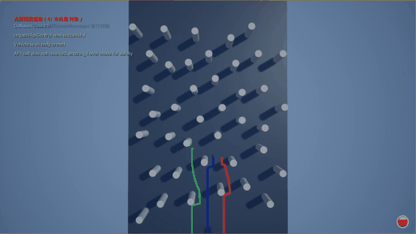

# T-RISE
T-RISE is an intelligent UAV-based platform for autonomous inspection in deep underground engineering environments.

## UAV Swarm Obstacle Avoidance Demonstrations

### Main Demonstration
**UAV swarm obstacle avoidance in a realistic tunnel simulation environment**

  

### Scenario-Based Demonstrations

<table align="center">
  <tr>
    <td align="center" width="33%">
      <strong>UAV swarm obstacle avoidance in a static obstacle environment</strong>  
      
    </td>
    <td align="center" width="33%">
      <strong>UAV swarm obstacle avoidance in static and dynamic obstacle environments</strong>  
      
    </td>
    <td align="center" width="33%">
      <strong>UAV swarm obstacle avoidance in a dust-filled environment</strong>  
      
    </td>
  </tr>
</table>
