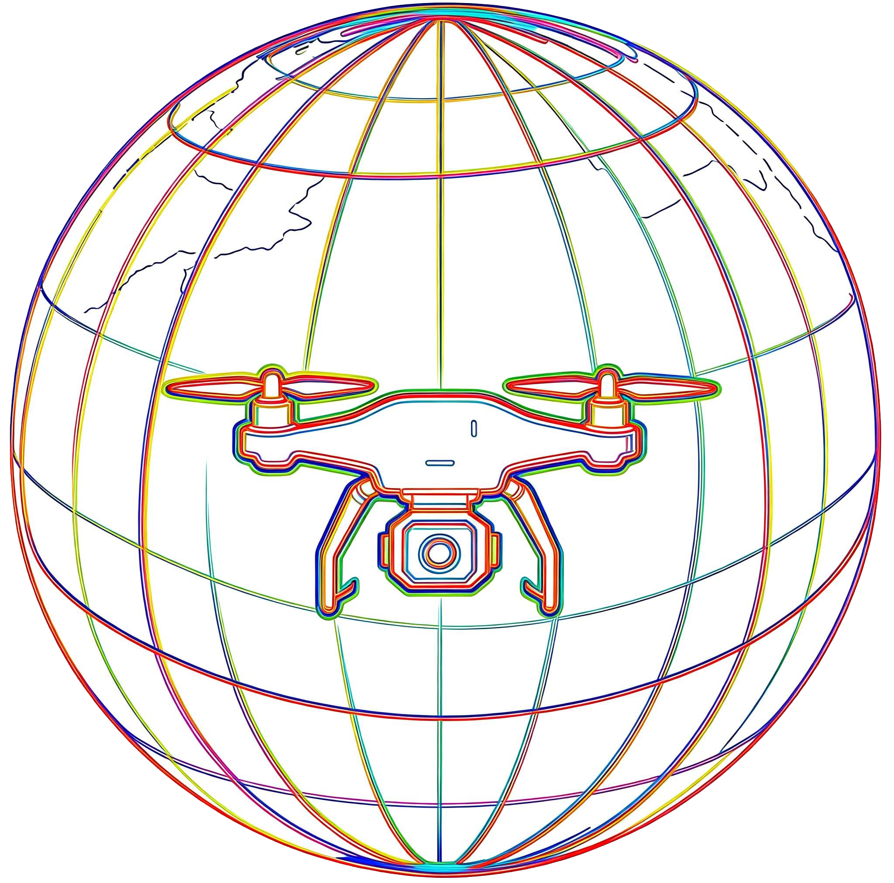
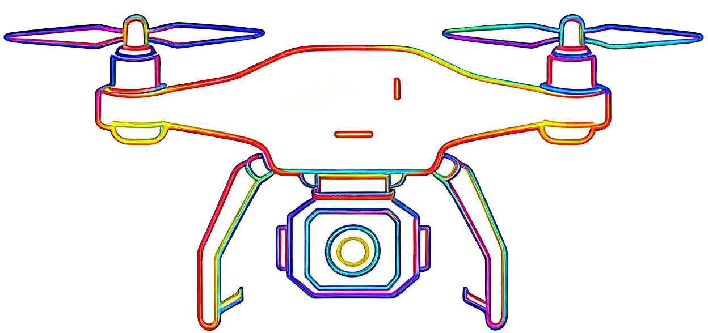
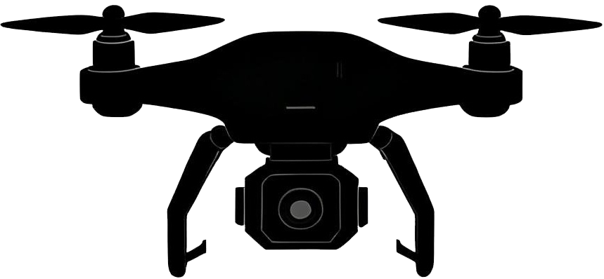

<table align="center">
  <tr>
    <td valign="middle" align="center">
      
    </td>
    <td valign="middle" align="left" style="padding-left: 14px;">
      <h1 style="margin: 0;">T-RISE</h1>
    </td>
  </tr>
</table>

  <a href="./README_CN.md">🌐 中文</a> |
  <a href="./README.md">🌐 English</a>

  <strong>一个面向深部地下工程环境自主巡检的智能UAV平台</strong>

  
  
  
  

---

## 👷 UAV集群避障演示

###  主要演示
**真实隧道仿真环境中的UAV集群避障效果**

  

###  场景化演示

<table align="center">
  <tr>
    <td align="center" width="33%">
      <strong> 静态障碍物场景</strong>
    </td>
    <td align="center" width="33%">
      <strong> 静态 + 动态障碍物场景</strong>
    </td>
    <td align="center" width="33%">
      <strong> 含粉尘环境场景</strong>
    </td>
  </tr>
  <tr>
    <td align="center" width="33%">
      
    </td>
    <td align="center" width="33%">
      
    </td>
    <td align="center" width="33%">
      
    </td>
  </tr>
</table>

  
  <em>展示了UAV集群在不同地下作业条件下的避障效果</em>
  

###  补充演示
**模拟粉尘隧道场景中的UAV集群避障效果**

  

**隧道中的UAV集群内部避障**

  

###  UAV自主巡检技术在地下工程中的典型应用场景

  

